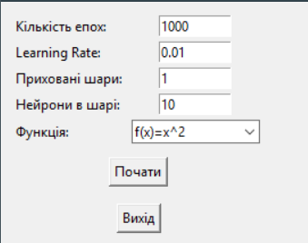
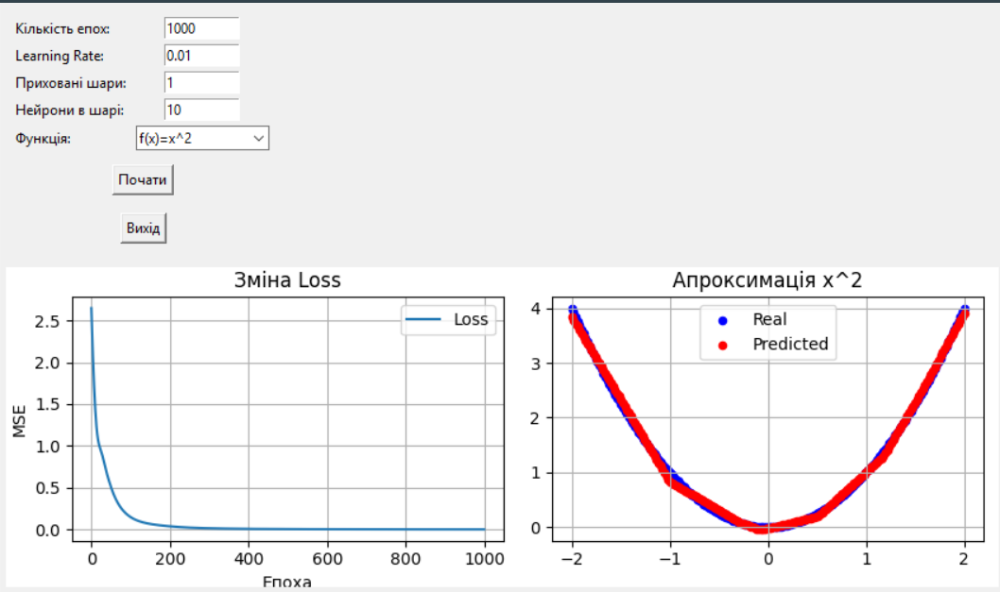

# Feedforward neural network v1.0
## Опис

Програма будує Feedforward network для апроксимації функцій.

## Функціонал
- Вибір кількості епох, шарів, нейронів, learning rate.
- Візуалізація графіка втрат (Loss) та результатів апроксимації.

---

## Завантаження та встановлення
1. **Завантажте** Lab2.zip [GitHub Releases](https://github.com/shurochkaa/Lab2-Feedforward-neural-network/releases/tag/1.0)
2. **Після встановлення** відкрийте ярлик gui.exe на робочому столі.

---

